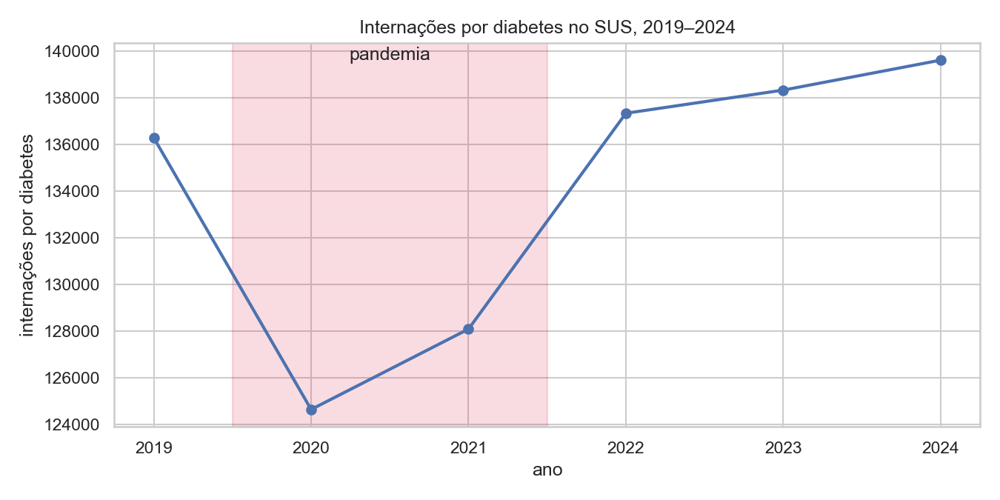

# Desigualdade Regional no Cuidado ao Diabetes no SUS

Projeto de Parceria do curso de Analista de Dados (EBAC/Semantix). Análise de 5.570 municípios brasileiros entre 2019 e 2024, medindo se o SUS entrega o mesmo cuidado ao diabético em todo o território — e quem paga a conta onde não entrega. O eixo central é o choque assistencial da pandemia (2020–2021) e a recuperação desigual que veio depois dele. O raciocínio completo do problema está em [`docs/01-problema.md`](docs/01-problema.md).

## Principais achados

Base: **804.249 internações por diabetes** no SUS entre 2019 e 2024, nos 5.570 municípios. Os totais foram reconciliados contra o TabNet do DATASUS com **divergência zero** em 162 combinações UF × ano.

**As amputações cresceram doze vezes mais rápido que as internações.** Entre 2019 e 2024, as internações subiram 2,4% e as amputações de membro inferior subiram **29,2%** — de 9.215 para 11.904 por ano. Não é que mais gente esteja adoecendo: é que quem chega ao hospital chega pior. Foram 63.863 amputações no período.

**A pandemia interrompeu o cuidado e a conta veio em amputações.** Em 2020–21 as internações caíram 7,3% enquanto as amputações subiram 10,7%. O volume se recuperou depois de 2022 e voltou acima do patamar de 2019; a gravidade não: a proporção de internações que terminam em amputação chegou a 8,25%, pior que durante o próprio choque.

**Homens são amputados 73% mais que mulheres, nas cinco regiões.** 10,46% contra 6,05%, com razão entre 1,51 e 2,28 dependendo da região — mas com letalidade **menor** (3,50% contra 4,18%) e idade de internação praticamente igual. Isso não descreve uma população mais doente; descreve uma população que chega mais tarde, já em estágio cirúrgico.

**A desigualdade regional é de duas vezes.** O Norte interna 120,2 por 100 mil contra 58,3 do Sudeste, já corrigido pela estrutura etária — e foi a região que mais piorou (+10,3%). O Sudeste inverte o padrão: menor taxa de internação e maior proporção de amputação (9,82%).

**Não houve recuperação geral, houve recuperação desigual.** Dos 3.365 municípios elegíveis ao ranking, 1.679 pioraram e 1.686 melhoraram. Centro-Oeste e Nordeste pioraram na média; Norte, Sul e Sudeste melhoraram.

**Custo:** R$ 759 milhões e 5,3 milhões de dias de leito no período.

Os achados completos, com as recomendações e as limitações — inclusive uma em que o próprio critério de robustez que estabeleci não foi atingido — estão em [`docs/04-conclusoes.md`](docs/04-conclusoes.md).



*A faixa sombreada marca 2020–2021. As internações caíram durante a pandemia e voltaram acima do patamar anterior; a proporção que termina em amputação não voltou.*

## Documentação

- [Execução manual — checklist](docs/00-execucao-manual.md) — o que precisa ser feito à mão, e por quê
- [Problema e justificativa](docs/01-problema.md)
- [Coleta de dados](docs/02-coleta-de-dados.md)
- [Modelagem](docs/03-modelagem.md)
- [Conclusões](docs/04-conclusoes.md)
- [Guia do dashboard Power BI](docs/05-dashboard-powerbi.md)

## Como reproduzir

O passo a passo detalhado, com o motivo de cada etapa manual, está em [`docs/00-execucao-manual.md`](docs/00-execucao-manual.md). Resumo:

1. `pip install -r requirements.txt`
2. `python scripts/baixar_populacao_ibge.py` — baixa a população do Censo 2022 por município, sexo e faixa etária (já versionada em `data/gold/populacao_municipio_faixa_sexo.parquet`, não precisa rodar de novo a menos que o dado mude)
3. `python scripts/baixar_cobertura_aps.py` — cobertura de APS pela API pública
4. Abrir `notebooks/01_ingestao_colab.ipynb` no Google Colab e executar — ele clona este repositório sozinho, sem upload manual — é a etapa longa (1.944 arquivos de AIH), idempotente, pode ser reexecutada após queda de sessão
5. Baixar `municipio_ano.csv` do Drive para `data/gold/`
6. Reconciliar contra o TabNet do DATASUS (divergência acima de 2% bloqueia a entrega)
7. `python -m pytest` — confere os módulos de cálculo (idade, padronização, índice, validação)
8. Executar `notebooks/02_eda.ipynb` e `notebooks/03_indice_icvd.ipynb`
9. Publicar a camada gold no Google Sheets
10. Seguir `docs/05-dashboard-powerbi.md` para construir o dashboard no Power BI Desktop e salvá-lo como `dashboard/diabetes_sus.pbix` — o `.pbix` é o resultado desse passo, não a entrada dele (Power BI Desktop é ferramenta gráfica; não há como gerar o arquivo por código)
11. Preencher `docs/04-conclusoes.md` e a seção "Principais achados" acima

## Estrutura de pastas

```
├── README.md
├── requirements.txt
├── docs/
│   ├── 00-execucao-manual.md     checklist de etapas manuais
│   ├── 01-problema.md
│   ├── 02-coleta-de-dados.md
│   ├── 03-modelagem.md
│   ├── 04-conclusoes.md          achados, recomendações e limitações
│   └── 05-dashboard-powerbi.md
├── notebooks/
│   ├── 01_ingestao_colab.ipynb   roda no Google Colab (bronze -> silver -> gold)
│   ├── 02_eda.ipynb              local, DuckDB + pandas
│   └── 03_indice_icvd.ipynb      local, calcula o ICVD e a trilha de gênero
├── sql/consultas_duckdb.sql
├── scripts/baixar_populacao_ibge.py
├── src/diabetes_sus/             pacote testado, usado localmente e no Colab
├── tests/                        65 testes, `python -m pytest`
├── data/gold/                    camada gold (CSV/Parquet, versionável)
├── dashboard/                    diabetes_sus.pbix, dashboard.pdf, previews/*.png
└── .gitignore                    bloqueia data/bronze/, data/silver/, .dbc, .dbf
```

## Stack

Python · pandas · DuckDB · PySpark (Colab) · pytest · Power BI Desktop · Google Sheets

## Fontes de dados

SIH/SUS e SIM (FTP DATASUS), e-Gestor Atenção Básica, CNES, população do Censo 2022 (IBGE/SIDRA), IDHM (Atlas Brasil/PNUD) e VIGITEL. Detalhamento completo, com URLs e método de acesso, em [`docs/02-coleta-de-dados.md`](docs/02-coleta-de-dados.md).

## Desvios declarados em relação ao briefing original

- **Visualização em Power BI, não Looker Studio** (pedido no briefing original) — decisão do autor, camada analítica é indiferente à ferramenta. Detalhes em `docs/05-dashboard-powerbi.md`.
- **Mapa por UF, não por município** — o Shape Map do Power BI não sustenta 5.570 polígonos de forma confiável. A granularidade municipal aparece na dispersão e nos rankings do dashboard.
- **Sem link público do dashboard** — o Power BI Service não aceita conta de e-mail pessoal (`@gmail.com`). Entrega via `.pbix` versionado, PDF e PNGs.
